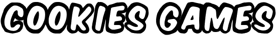

<div id="top"></div>

<!-- PROJECT SHIELDS -->
<!--
*** I'm using markdown "reference style" links for readability.
*** Reference links are enclosed in brackets [ ] instead of parentheses ( ).
*** See the bottom of this document for the declaration of the reference variables
*** for contributors-url, forks-url, etc. This is an optional, concise syntax you may use.
*** https://www.markdownguide.org/basic-syntax/#reference-style-links
-->

<!--[![Contributors][contributors-shield]][contributors-url]
[![Stargazers][stars-shield]][stars-url]-->
[![MIT License][license-shield]][license-url]
[![LinkedIn][linkedin-shield]][linkedin-url]

<!-- PROJECT LOGO -->
<br />
<div align="center">
  <a href="https://github.com/DorianFournier/cookies-games">
    
  </a>

  <h3 align="center">Cookies Games</h3>

  <p align="center">
    Try to win a maximum of cookies !
    <br />
    <a href="https://github.com/DorianFournier/cookies-games"><strong>Explore the docs »</strong></a>
    <br />
    <br />
    <a href="#demo">View Demo</a>   
    ·
    <a href="https://github.com/DorianFournier/cookies-games/issues">Report Bug</a>
    ·
    <a href="https://github.com/DorianFournier/cookies-games/pulls">Request Feature</a>
  </p>
</div>


<!-- TABLE OF CONTENTS -->
<details>
  <summary>Table of Contents</summary>
  <ol>
    <li>
      <a href="#about-the-project">About The Project</a>
    </li>
    <li>
      <a href="#getting-started">Getting Started</a>
      <ul>
        <li><a href="#clone-the-repository">Clone the repository</a></li>
        <li><a href="#prerequisites">Prerequisites</a></li>
      </ul>
    </li>
    <li><a href="#sources">Sources</a></li>
    <li><a href="#license">License</a></li>
    <li><a href="#demo">Demo</a></li>
  </ol>
</details>

<!-- ABOUT THE PROJECT -->
## About The Project
<div align="center">
  </br>
  
  </br></br>
</div>

Welcome to the best games platform ever made (I exaggerate a little bit) !

Development tools used :
* Qt
* C++
* Linux 
* Git and GitHub 🙂

<p align="right">[<a href="#top">back to top</a>]</p>


<!-- GETTING STARTED -->
## Getting Started

If you are interested in this game, follow these steps to download all necessary dependencies !

<!-- CLONE THE REPOSITORY -->
### Clone the repository

_Don't forget to click the "star button"_

1. Clone the repo to your local computer
   ```sh
   git clone git@github.com:your_username/cookies-games.git
   ```
   or
   ```sh
   git clone https://github.com/your_username/cookies-games.git
   ```

<p align="right">(<a href="#top">back to top</a>)</p>


<!-- PREREQUISITES -->
### Prerequisites

First of all, you need to install Qt.

1. Linux
   ```sh
   sudo apt-get install qt5-default
   ```
2. Windows
Go to this page : https://www.qt.io/download

Check to have all the Qt environment : include Qt Creator and Qt Design (if you want to modify the project)

<p align="right">[<a href="#top">back to top</a>]</p>


<!-- SOURCES -->
## Sources
- Official documentation for Qt : https://doc.qt.io/
- Qt TicTacToe : https://github.com/aosama16/Qt-Tic-Tac-Toe

<p align="right">[<a href="#top">back to top</a>]</p>


<!-- LICENSE -->
## License

Distributed under the MIT License. See `LICENSE.txt` for more information.

<p align="right">[<a href="#top">back to top</a>]</p>


<!-- ACKNOWLEDGMENTS -->
## Demo

<h4 align="center">HOME PAGE</h4>
<p align="center">
  
  </br></br>
</p>

<h4 align="center">FIND THE COOKIE</h4>
<p align="center">

</br></br>
</p>

<h4 align="center">TIC TAC TOE</h4>
<p align="center">


</p>

<p align="right">[<a href="#top">back to top</a>]</p>


<!-- MARKDOWN LINKS & IMAGES -->
<!-- https://www.markdownguide.org/basic-syntax/#reference-style-links -->
[contributors-shield]: https://img.shields.io/github/contributors/othneildrew/Best-README-Template.svg?style=for-the-badge
[contributors-url]: https://github.com/othneildrew/Best-README-Template/graphs/contributors
[stars-shield]: https://img.shields.io/github/stars/othneildrew/Best-README-Template.svg?style=for-the-badge
[stars-url]: https://github.com/DorianFournier/Flappy-thon/stargazers
[license-shield]: https://img.shields.io/github/license/othneildrew/Best-README-Template.svg?style=for-the-badge
[license-url]: https://github.com/othneildrew/Best-README-Template/blob/master/LICENSE.txt
[linkedin-shield]: https://img.shields.io/badge/-LinkedIn-black.svg?style=for-the-badge&logo=linkedin&colorB=555
[linkedin-url]: https://www.linkedin.com/in/dorian-fournier/
